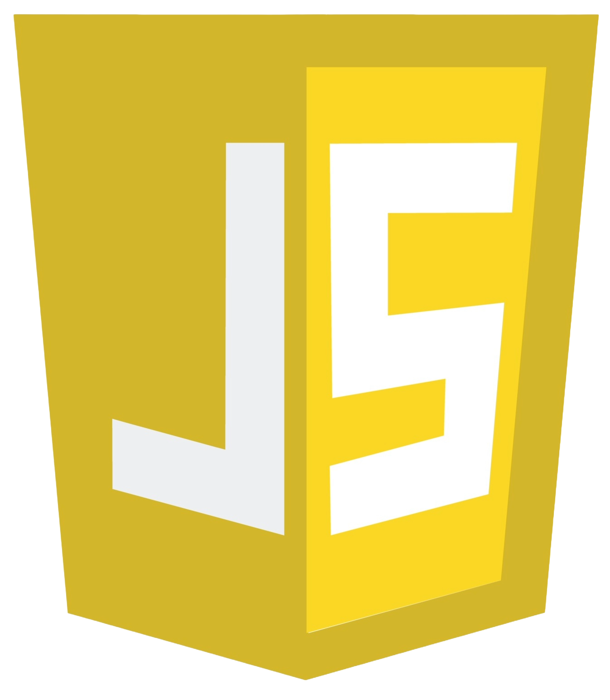
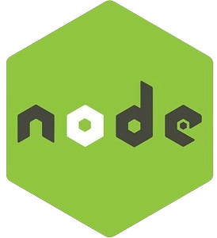

<!-- Header Section -->
<h1 align="center">Hi👋, I'm Shreya Shahu </h1>
<h3 align="center"><a href="https://www.linkedin.com/in/shreyashahu/" target="_blank" rel="noreferrer">Shreya</a> is a passionate Full Stack Developer from India, working on Web Development Projects for 6+ months now. Feel free to reach out for any Freelance Projects.</h3>
 

<!-- GIF -->

<!-- Languages and Tools Section -->
<h3 align="left">Languages and Tools:</h3>

- I create seamless digital experiences, from frontend design to backend functionality.
- I’m looking to collaborate on **Full Stack Development Projects**

#### Programming Language Stack

    

#### FrontEnd Stack

      

#### BackEnd Stack

#### Database Stack

 

#### Project Management Stack

   

#### Editor / IDE I ♥

 

<!-- Contact Section -->
<h3 align="left">Connect with me:</h3>

- 💬 Ask me about **Development**
- 📫 How to reach me **[shreyashahu1404@gmail.com](mailto:cloudchamp44@gmail.com)**
- ⚡ Fun fact **I've hit coding milestones and bullseyes, earning the title of a shooting champion while mastering code.**