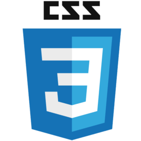
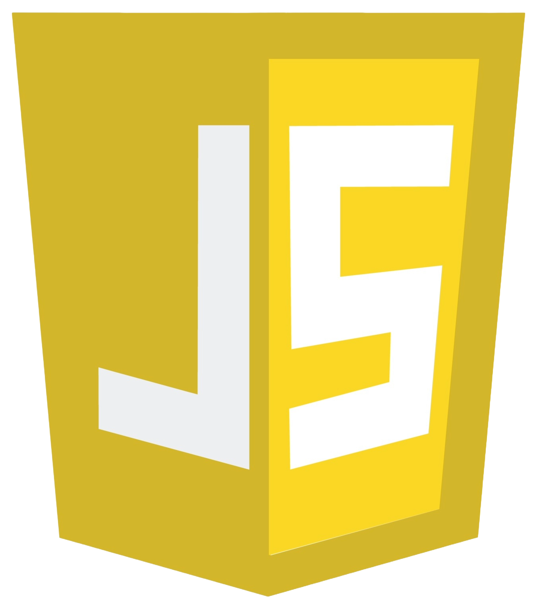
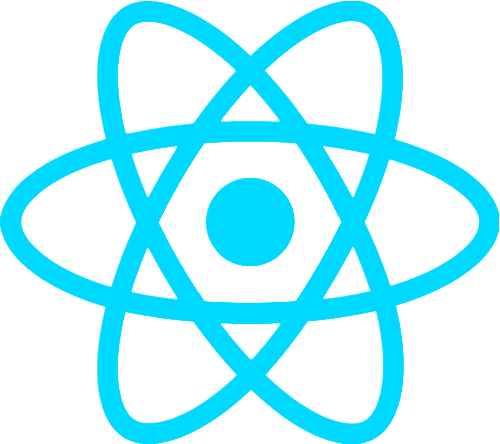
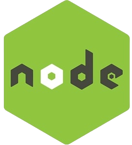

<!-- Header Section -->
<h1 align="center">Hi 👋, I'm Shreya Shahu</h1>
<h3 align="center">

Aspiring Machine Learning Engineer | Computer Vision & Deep Learning Enthusiast

</h3>

 

<!-- GIF -->

<!-- About -->
<h3 align="left">About Me</h3>

- 🎓 Final-year **B.Tech Information Technology** student (CGPA: **8.7**)
- 🤖 Interested in **Machine Learning, Deep Learning and Computer Vision**
- 🧠 Experience building **end-to-end AI systems** from model training to deployment
- 🌱 Worked on projects across **agriculture, healthcare and autonomous systems**
- 🏆 **Student of the Year Award** recipient & **Techtrends 2024 – 1st Place** (International Conference)

---

<!-- Skills Section -->
<h3 align="left">Languages and Tools</h3>

#### Programming Languages

#### Machine Learning & AI

#### Data Science & Libraries

#### Web & Deployment

#### Databases

#### Tools & Platforms

#### IDE

---

<!-- Projects -->
<h3 align="left">Highlighted Projects</h3>

- 🌿 **Plant Disease Detection** – CNN-based model with **98.5% accuracy** on PlantVillage dataset  
- 🚁 **Autonomous Search & Rescue Drone** – Real-time object detection using **YOLOv8 + Flask**  
- 👁️ **Glaucoma Detection** – Transformer-based model achieving **AUC 0.96** on retinal scans  

---

<!-- Contact -->
<h3 align="left">Connect with Me</h3>

- 💬 Ask me about **Machine Learning, Computer Vision or AI Projects**
- 📫 Reach me at **shreyashahu1404@gmail.com**
- ⚡ Fun fact: **National-level shooting champion with a passion for precision - both in sports and code**
